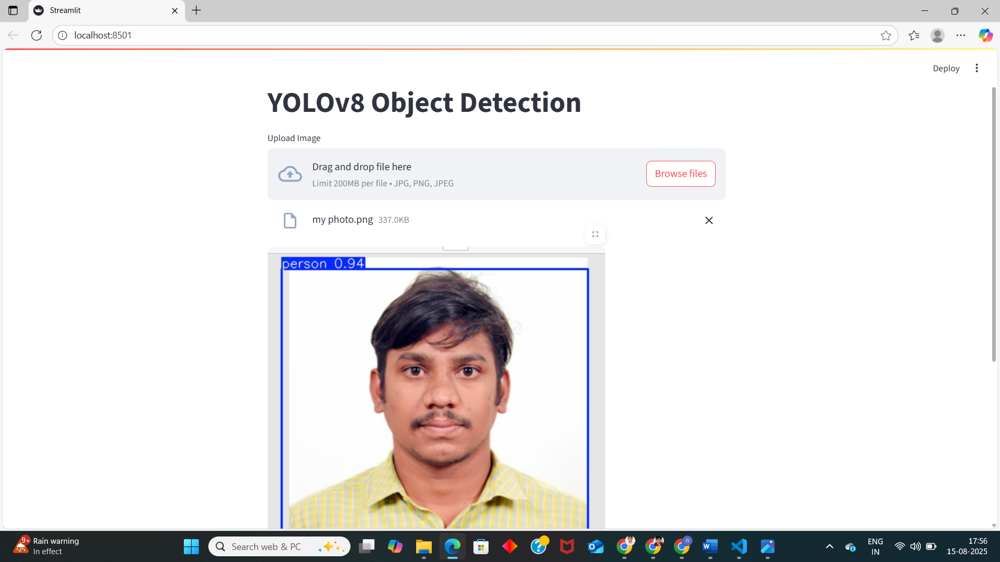

## Object Detection using YOLOv8n

This project implements real-time object detection using the lightweight [YOLOv8n](https://docs.ultralytics.com/models/yolov8) (nano) model by Ultralytics. It is designed to detect and classify multiple objects in images, videos, or webcam streams efficiently.

---

##  Features

-  Lightweight YOLOv8n model for fast inference
- Supports image, video, and live webcam input
-  Easily deployable using Streamlit
-  Customizable confidence threshold
-  Easily extendable for custom datasets

---

##  Tech Stack

- **YOLOv8n** – Ultralytics
- **OpenCV** – Image processing
- **Streamlit** – Web UI for app deployment
- **Python 3.8+**
- **PyTorch** backend

---

##  Project Structure

```
object_detection_yolov8/
├── object_detection.py       # Main YOLO inference logic
├── requirements.txt          # Python dependencies
├── streamlit_app.py          # Streamlit interface
├── test_images              # Sample images/videos for testing
└── README.md                 # Project overview
```

---

## Installation

1. **Clone the repository**  
```bash
https://github.com/6303-naidu/object_detection.git
cd object_detection_yolov8
```

2. **Create virtual environment (optional)**  
```bash
python -m venv venv
source venv/bin/activate  # or venv\Scripts\activate on Windows
```

3. **Install dependencies**  
```bash
pip install -r requirements.txt
```

---

## Usage

###  Run detection on an image

```bash
python object_detection.py --source path/to/image.jpg


```

## How to Run
# for image Detection
streamlit run app.py

### Live webcam detection

```bash
python object_detection.py --source 0
```
|  | 
 ##  Sample Results

| Image | Detection |
|-------|-----------|
|  |  |

 ## ## Model Info

- **Model:** YOLOv8n (nano)
- **Parameters:** ~3.2M
- **Speed:** ~70+ FPS on modern GPU
- **Use Case:** Ideal for edge devices or real-time apps

---

##  Acknowledgements

- [Ultralytics YOLOv8](https://github.com/ultralytics/ultralytics)
- [Streamlit](https://streamlit.io/)
- [OpenCV](https://opencv.org/)

---

##  License

This project is licensed under the MIT License.


